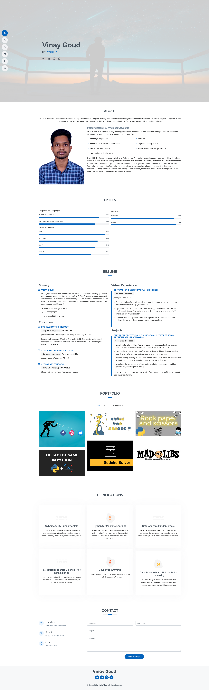

# My Portfolio Website

This is my portfolio website repository! This repository contains the source code of my personal portfolio website.

## Table of Contents
- [Overview](#overview)
- [Live Demo](#live-demo)
- [Features](#features)
- [Technologies Used](#technologies-used)
- [Setup](#setup)
- [Usage](#usage)
- [Contributing](#contributing)
- [License](#license)

## Overview

This website serves as my personal portfolio, showcasing my skills, projects, and experiences. It is designed to provide visitors with an overview of my work and background.

## Live Demo

You can check out the live demo of my portfolio website at [https://vinay-goud.github.io/Portfolio/](https://vinay-goud.github.io/Portfolio/).



## Features
- **Home:** my name and Qualification and social links.
- **About:** An introduction to who I am and my background.
- **Resume:** my Resume consisting my full information.
- **Portfolio:** A collection of my projects with descriptions and links.
- **Certifications:** My top Certifications and it's details.
- **Contact:** A way for visitors to get in touch with me.

## Technologies Used

- HTML5
- CSS3
- JavaScript
- PHP
- Bootstrap Framework

## Setup

To set up this project locally, follow these steps:

1. Clone the repository to your local machine:

   ```bash
   git clone https://github.com/vinay-goud/Portfolio.git

2.Navigate to the project directory:

 ```bash
    cd Portfolio
 ```
 3.Open the <b>index.html</b> file in your preferred web browser to view the website locally.

## Usage

To run the website locally, simply open the index.html file in your web browser. You can also host it using a web server of your choice if you wish to deploy it for public access.

## Contributing

If you'd like to contribute to this project, please follow these guidelines:

    Fork the repository.
    Create a new branch for your feature or bug fix.
    Make your changes and commit them with descriptive messages.
    Push your changes to your fork.
    Submit a pull request to the main branch of this repository.

## License

This project is licensed under the ***&#169; Portfolio Vinay*** - see the [LICENSE](https://vinay-goud.github.io/Portfolio/) file for details.
